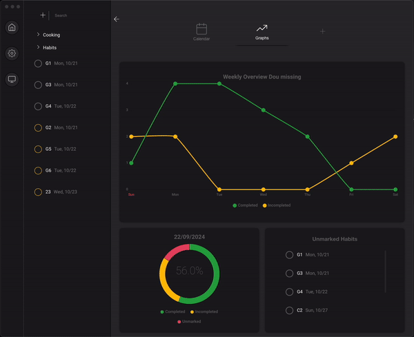
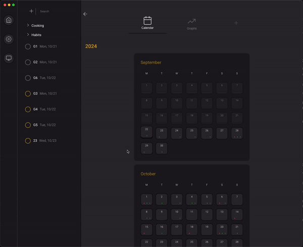
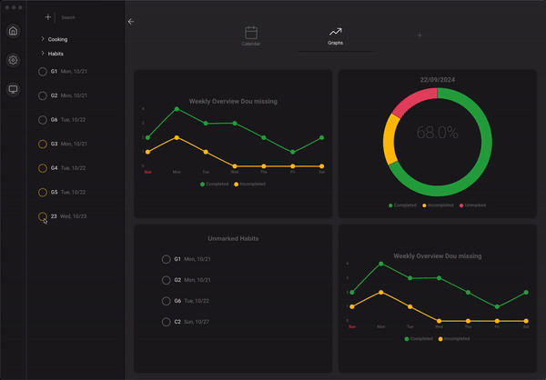

<!--
**Lindefor/Lindefor** is a ✨ _special_ ✨ repository because its `README.md` (this file) appears on your GitHub profile.
-->

I'm a **KTH Royal Institute of Technology** graduate who is all about ML/Data, with an additional passion for **DevOps/DevEx**.

- 🎩 Currently working as a ML/data consultant at Netlight!
- 🚀 Also serving as the CIO and ML Lead at [Tuva](https://tuva.app/)!

## Current Personal Project

### [Vana](https://github.com/Lindefor/vana) - Simplifying Habit Tracking

I'm developing **Vana**, an in-progress habit tracker built with **Electron** and **SvelteKit**. Vana aims to revolutionize the way you track habits by offering an intuitive and powerful interface. With its minimalistic and currently evolving design, it will keep your focus on what's truly important—your habits.

| 🌟Easy Progress Tracking🌟 | 🌟Structured Overview🌟 | 🌟Zero Interaction Overhead🌟 |
| ------------- | ------------- | ------------- |
|   |   |   |

🔗 **Feature Requests**: Have any ideas or suggestions? Feel free to (soon be able to) submit [feature requests](#) for Vana.

<h3 align="left">Let's talk!:</h3>

  

