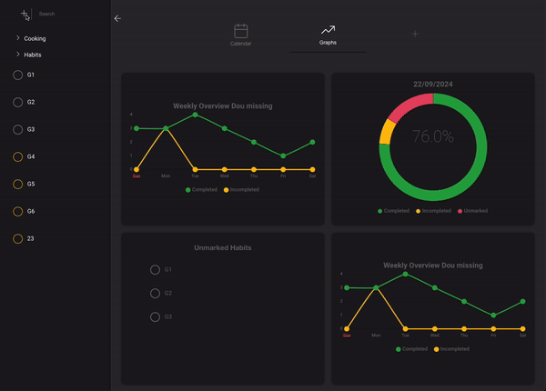

<!--
**Lindefor/Lindefor** is a ✨ _special_ ✨ repository because its `README.md` (this file) appears on your GitHub profile.
-->

I'm a 5th year Computer Science student at **KTH Royal Institute of Technology**, focusing on **DevOps** and **Machine Learning/Deep Learning**, with an additional passion for **Cyber Security**.

- 🚀 Currently serving as the CIO at a startup where we're creating the future for **Digital Audio Workstations (DAWs)**. Stay **tuned** for our beta testing phase next year!
- 🎓 Also working as a Teaching Assistant in a database course at KTH.

## Current Personal Project

### Vana - Simplifying Habit Tracking

I'm developing **Vana**, an in-progress habit tracker built with **Electron** and **SvelteKit**. Vana aims to revolutionize the way you track habits by offering an intuitive and powerful interface. With its minimalistic and currently evolving design, it will keep your focus on what's truly important—your habits.

Real-time progress tracking with customizable graphs based on datasets you choose. 

The calendar overview will provide a comprehensive view of your habit statuses,  
allowing you to effortlessly add habits to specific dates—whether they're  
one-time events, recurring, or custom schedules. 

Vana will store your habits locally, ensuring your data is secure and easily accessible.  
Plus, you will be able to import habit structures from other users with just a click,  
making it a collaborative and flexible tool for everyone. 

🔗 **Feature Requests**: Have any ideas or suggestions? Feel free to (soon be able to) submit [feature requests](#) for Vana.

<h3 align="left">Connect with me:</h3>

